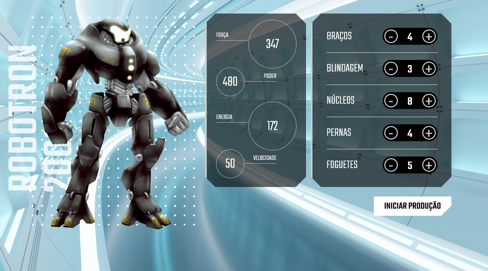

# Robotron 2000

## Descrição

Inspirado nos antigos jogos de tiro em arena, o Robotron 2000 traz a possibilidade de montar o seu robô para defender a Terra da invasão alienígena.

Nesta página, você poderá escolher os atributos do seu robô e atualizar os dados de Força, Poder, Energia, Velocidade de acordo com a quantidade de partes escolhidas.

## Aprendizado

Utilizando apenas HTML, CSS e JavaScript e seguindo os ensinamentos do @PedroMarins no curso da #Alura, aprendi melhor a trabalhar a manipulação de DOM (Document Object Model) para utilizar os estados e cliques dos botões e alterar dinamicamente os dados dos atributos do Robotron.

O JavaScript realiza manipulação de atributos e atualização de estatísticas com base em um conjunto de peças. O código possui funcionalidades que permitem aumentar ou diminuir a quantidade de uma determinada peça e atualizar as estatísticas correspondentes.

## Funcionalidades

A aplicação oferece as seguintes funcionalidades:

- Manipulação de atributos:
    - O código permite aumentar ou diminuir a quantidade de uma peça específica.
    - Ao clicar nos botões de controle correspondentes a cada peça, a quantidade da peça é ajustada.

- Atualização de estatísticas:
    - Após a manipulação da quantidade de uma peça, as estatísticas correspondentes são atualizadas.
    - As estatísticas incluem: força, poder, energia e velocidade.
    - Cada peça possui valores diferentes para cada estatística.

## Observações

Este código é apenas um exemplo e pode ser personalizado e adaptado de acordo com suas necessidades. Certifique-se de verificar os seletores e os elementos do seu projeto para garantir que estão alinhados corretamente.

Lembre-se de incluir o script JavaScript corretamente em seu projeto e de verificar se os elementos HTML possuem os atributos `data-controle`, `data-estatistica` e `data-contador` conforme necessário.

Divirta-se experimentando as funcionalidades do código e adaptando-o para suas necessidades específicas!

## Requisitos do Sistema

- Navegador da web atualizado (recomendado: Google Chrome, Mozilla Firefox, Safari).
- Conexão com a internet para carregar o jogo e salvar sua pontuação.

## Contribuição

Este projeto está em desenvolvimento ativo e contribuições são bem-vindas. Se você tiver sugestões, melhorias ou correções de bugs, sinta-se à vontade para abrir uma pull request ou relatar problemas na seção "Issues" do projeto.